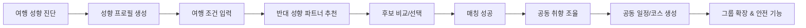
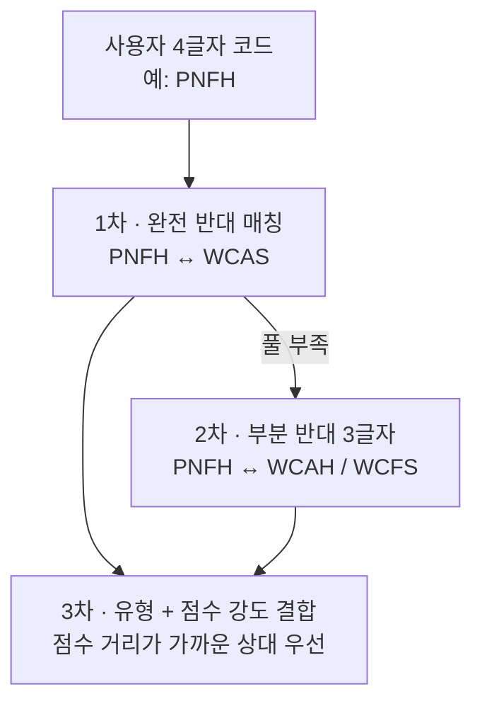
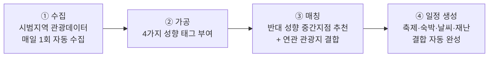
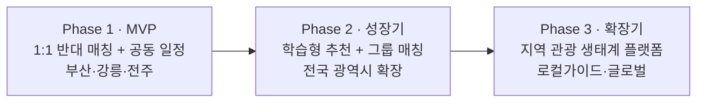
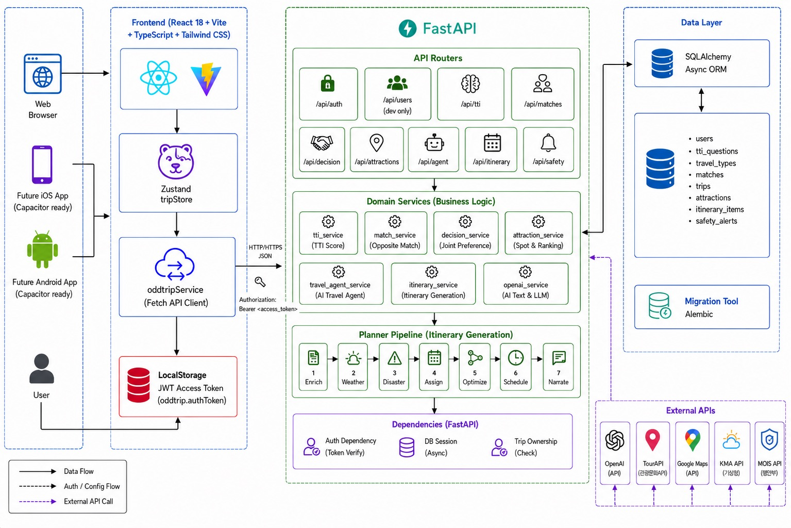
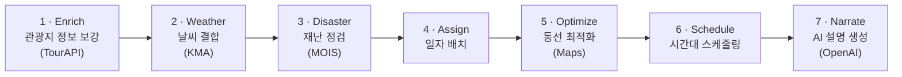

<div align="center">


<a href="https://www.typingsvg.com">
  
</a>

<br/>

[](https://odd-trip.vercel.app)
[](https://oddtrip.onrender.com/docs)

<br/>


</div>

<br/>

> ### 💡 한 줄 소개
> **취향 기반 여행 가이드 & 매칭 플랫폼 — 반대 성향의 여행자와 함께 떠나는 여행**

OddTrip은 단순히 비슷한 사람을 추천하는 앱이 아닙니다. 사용자의 여행 성향을 **자체 진단**으로 분석하고, 나와 **상호보완적인(반대) 성향**을 가진 여행자와 연결한 뒤, 두 사람의 취향을 **균형 있게 반영한 관광지와 공동 일정**을 자동으로 생성합니다.

<br/>

## 📑 목차

- [🛠️ 구현 (Implementation)](#️-구현-implementation)
  - [🏗️ 구현 — 시스템 아키텍처](#️-구현--시스템-아키텍처)
  - [⚙️ 구현 — 도메인 서비스 (Business Logic)](#️-구현--도메인-서비스-business-logic)
  - [🧩 구현 — 플래너 파이프라인 (Itinerary Generation)](#-구현--플래너-파이프라인-itinerary-generation)
  - [🗄️ 구현 — 데이터 모델](#️-구현--데이터-모델)
  - [🧰 구현 — 기술 스택](#-구현--기술-스택)
  - [📂 구현 — 폴더 구조](#-구현--폴더-구조)
  - [🔌 구현 — API 구성](#-구현--api-구성)

<br/>

## 🧭 기획 배경 및 필요성

### 1. 기획 배경

<table>
<tr><td width="180"><b>🚶 여행 패러다임 변화</b></td>
<td>여행이 단체에서 <b>1인 중심</b>으로 빠르게 재편. 문체부 2024 국민여행조사 기준 1인 여행객 비중은 2018년 2.5% → 2024년 3.1%로 안착, 6인 이상 단체여행은 절반 이상 감소.</td></tr>
<tr><td><b>🤝 새로운 인연 추구</b></td>
<td>틴더 2025 조사에서 한국인 응답자의 <b>80%</b>가 여행 중 새로운 사람과 교류할 의향이 있다고 답해 아태 지역 2위. 혼자 떠나면서도 새로운 인연을 능동적으로 추구.</td></tr>
<tr><td><b>🔁 기존 서비스 한계</b></td>
<td>트립소다·트래블어스 등 기존 동행 매칭은 모두 <b>유사성 매칭</b>에 머물러 필터 버블을 강화. 여행을 확장하는 도구가 아니라 일상화하는 도구로 기능.</td></tr>
<tr><td><b>🧠 심리학적 근거</b></td>
<td>Dryer & Horowitz(1997, <i>JPSP</i>) 연구에 따르면 <b>상호보완적 파트너십</b>이 유사성 기반 관계보다 더 높은 상호작용 만족도를 보임. 그러나 시장에는 상호보완성 가설을 적용한 서비스가 부재.</td></tr>
</table>

### 2. 서비스 필요성

- **시장적 필요성** — 1인 여행 시장은 폭증했지만 단일한 유사성 매칭 모델만 존재해, 새로운 만남을 원하는 사용자층이 사각지대에 놓여 있다.
- **수요적 필요성** — 기존 동행 매칭 서비스는 모두 유사성 기반이어서, 여행 맥락의 상호보완적 만남을 제공하는 서비스는 부재 상태다.

<details>
<summary><b>📈 한국관광공사 2026 관광 트렌드(L.I.S.M.D)와의 연관성</b></summary>

<br/>

| 트렌드 | 본 서비스와의 연결 |
| :-- | :-- |
| **L** — Local Re-creation | 반대 성향 이용자가 함께 설계하며 로컬 카페·숨은 명소·체험 공간을 새롭게 경험 |
| **I** — Individual Value Spectrum | 계획형↔즉흥형, 절약형↔가치소비형 등 서로 다른 가치관을 조합해 새 개인화 기준 생성 |
| **S** — Spatial Experience | 관광지·음식점·숙소·체험을 조합해 경험 밀도 높은 공간 중심 여행 설계 |
| **M** — Multi-Generation Flow | 다양한 성향·세대별 특성을 유연하게 수용하는 구조 |
| **D** — Digital Humanity | AI 성향 분석·추천을 쓰되 목적은 기술이 아닌 <b>사람 간 연결</b>에 둠 |

</details>

<br/>

## 🎯 서비스 개요 & 주요 기능



| # | 기능 | 설명 |
| :--: | :-- | :-- |
| 1 | 🧬 **성향 진단 & 프로필 생성** | 일정·활동·소비·대화 성향 질문에 답해 여행 성향 프로필을 생성 |
| 2 | 🤝 **반대 성향 파트너 추천** | 지역·일정·예산을 입력하면 성향을 보완하는 반대 성향 사용자를 우선 추천 |
| 3 | 🔍 **매칭 후보 비교** | 추천 파트너의 성향·선호 지역·예산·스타일을 나란히 비교하여 선택 |
| 4 | 🗳️ **공동 취향 조율** | 장소·활동·음식 등 선호를 함께 정리하고 조율 |
| 5 | 🗓️ **공동 일정 & 코스 생성** | 관광지·음식점·숙소·축제를 바탕으로 일정 작성, 우선순위·동선 조정 |
| 6 | 👥 **소규모 그룹 확장** | 1:1 이후 일정·지역·예산이 맞는 사용자를 더해 3~4인 그룹으로 확장 |
| 7 | 🛡️ **안전 & 신뢰 관리** | 프로필 인증, 신고·차단, 일정 공유로 신뢰할 수 있는 이용 환경 조성 |

<br/>

## ⭐ 서비스 차별성

> 시장 전체가 **유사성 매칭**이라는 단일 패러다임에 갇혀 있고 성향 파악도 단순 프로필 입력 수준에 그친다. OddTrip은 **관광심리학 이론에 기반한 자체 진단으로 반대 성향을 매칭**하고, 매칭 이후 **취향 조율 → 우선순위 협의 → 공동 일정/코스 생성**까지 단일 흐름으로 잇는다.

| 구분 | 데이팅·BFF | 여행앱<br/>(Tripadvisor 등) | 동행앱<br/>(Backpackr 등) | **OddTrip** |
| :-- | :-- | :-- | :-- | :-- |
| **핵심 목적** | 관계 형성 | 장소·일정 탐색 | 함께 갈 사람 찾기 | **상호보완 성향 매칭으로 새 자극** |
| **매칭 기준** | 관심사·상호 관심 | 사람보다 장소 | 같은 지역·관심사 | **반대 성향(계획↔즉흥 등) 상보 조합** |
| **매칭 후 흐름** | 채팅 중심 | 일정 저장·공유 | 채팅·동행 모집 | **취향 조율→일정→코스까지 한 흐름** |
| **비교 기능** | 제한적 | 거의 없음 | 약함 | **성향·예산·스타일 나란히 비교** |
| **갈등 조정** | 약함 | 개인 최적화 | 부족 | **성향 차이를 조율 대상으로 설계** |
| **확장성** | 1:1 중심 | 개인 준비 단계 | 정교한 그룹 설계 제한 | **3~4인 그룹 여행으로 확장** |
| **성향 파악** | 프로필 입력 | 선호 입력 | 단순 설문 | **관광심리 이론 기반 자체 진단** |

<sub>성향 진단은 Plog의 psychographic model, Tourist Role Scale, Travel Needs Scale, Novelty Seeking 개념을 참고해 자체 설문으로 구성.</sub>

<br/>

## 🧬 반대 성향 매칭 메커니즘

사용자의 여행 스타일을 **4가지 축**으로 분류한다. 각 축은 알파벳 한 글자로 표현되며, 4글자 조합으로 여행 유형을 나타낸다.

| 축 | 코드 | 의미 |
| :-- | :-- | :-- |
| **일정 스타일** | **P**lanner ↔ **W**anderer | 미리 짜는가 ↔ 즉흥적으로 움직이는가 |
| **여행 무대** | **N**ature ↔ **C**ity | 자연·휴양 ↔ 도시·문화 |
| **즐기는 방식** | **F**ood ↔ **A**ctivity | 먹는 즐거움 ↔ 몸으로 부딪히는 즐거움 |
| **발견 취향** | **H**ot ↔ **S**ecret | 검증된 명소 ↔ 나만의 발견 |

각 축에서 한 글자씩 골라 조합하면 **16개 유형**, 모든 글자가 반대인 유형끼리 짝지어 정확히 **8쌍의 반대 매칭**이 형성된다.

<details>
<summary><b>📐 점수 산출 방식</b></summary>

<br/>

각 축 3문항 중 같은 답변 개수에 따라 −1.0 ~ +1.0 점수를 부여한다.

| A 응답 개수 | 점수 | 강도 |
| :--: | :--: | :-- |
| 3개 | **+1.0** | 강한 P/N/F/H |
| 2개 | **+0.33** | 약한 P/N/F/H |
| 1개 | **−0.33** | 약한 W/C/A/S |
| 0개 | **−1.0** | 강한 W/C/A/S |

→ 사용자는 4차원 성향 벡터로 표현된다. 예: `P+1.0, N+0.33, F−0.33, H+1.0` → **PNFH** (N·F축은 약함)

</details>

**매칭 알고리즘 (3단계)**



**추천 관광지 도출** — 매칭된 두 사용자의 4차원 벡터의 **중점**을 계산해, 그 중점에 가까운 성향 태그를 가진 관광지를 우선 추천한다.

> 예) `PNFH (+1.0, +0.33, −0.33, +1.0)` × `WCAS (−1.0, −0.33, +0.33, −1.0)` → 중점 `(0, 0, 0, 0)`
> → 두 사람 모두에게 새롭지만 거부감 없는 **균형 잡힌 관광지**가 자동 도출된다.

<br/>

## 📊 공공데이터 활용 방안

### 활용 공공 OpenAPI

| 구분 | API | 역할 |
| :-- | :-- | :-- |
| **필수 ①** | 한국관광공사 국문 관광정보(TourAPI 4.0) | 관광지·축제·숙박·음식점 등 8개 분야 통합 인프라 |
| **필수 ②** | 한국관광공사 연관 관광지 정보 | 중심 관광지와 연결성 높은 관광지·음식·숙소 50위까지 → 일정 자동 생성 근거 |
| 보조 ③ | 관광지 집중률·방문자 추이 예측 | 혼잡 회피 / 축제 시기 우선 추천 |
| 보조 ④ | 관광 빅데이터 정보서비스 | 통신사 데이터 기반 방문자 추이, 지역 활성화 측정 |
| 보조 ⑤ | 기상청 관광지 상세 날씨 | 관광지 단위 예보·기상지수로 일정 실용성 강화 |
| 보조 ⑥ | 행정안전부 긴급재난문자 | 호우·태풍·지진 발생 시 매칭 사용자에게 자동 알림 |
| 선택 ⑦ | 카카오 지도·길찾기 | 동선 시각화, 이동시간 자동 계산 |

> 💡 **세 축의 공공데이터 시너지** — 관광 정보(한국관광공사) + 기상 정보(기상청) + 안전 정보(행정안전부)를 결합해, 단순 매칭 앱을 넘어 **신뢰할 수 있는 여행 동반자 플랫폼**을 구축한다. 모든 데이터가 공공기관 제공이라 신뢰성이 보장되고, 별도 구매 없이 지속 가능하다.

### 4단계 데이터 활용 흐름



<details>
<summary><b>② 가공 — 관광지 성향 태그 부여 기준</b></summary>

<br/>

| 성향 축 | 태그 부여 기준 | 예시 |
| :-- | :-- | :-- |
| 계획형 ↔ 즉흥형 | 운영시간·휴무일·예약 필수 여부 | 사전예약 필요 → 계획형 |
| 도시형 ↔ 자연형 | 관광공사 분류체계(자연 vs 인문) | 자연·휴양 → 자연형 |
| 미식형 ↔ 체험형 | 주변 콘텐츠 분포(음식점 vs 레포츠) | 음식점 밀집 → 미식형 |
| 인기형 ↔ 숨은형 | 방문자 추이 예측 + 검색 빈도 | 집중률 하위 30% → 숨은형 |

</details>

**데이터 활용 차별 포인트**
- **매칭의 근거 데이터** — 자기소개로 알 수 없는 '실제 여행의 모양'을 관광지 성향 태그·일정 데이터로 추론
- **추천의 신뢰 데이터** — 별점 후기의 편향을 공공기관 정량 데이터로 보완
- **지역 확산 데이터** — '숨은형' 사용자에게 방문 집중률 하위 30% 콘텐츠를 우선 추천해 명소 쏠림 완화

<br/>

## 🚀 서비스 발전 방향



| 단계 | 핵심 내용 |
| :-- | :-- |
| **Phase 1 · MVP** | 4축 성향 진단·1:1 매칭·공동 일정·인증/신고. 시범지역 부산·강릉·전주. KPI: 매칭 성사율 / 일정 완주율 / 재매칭 의향 |
| **Phase 2 · 성장기** | 만족도 상위 20% 패턴을 매칭 가중치에 반영, 일정·예산 겹치는 3~4인 그룹 매칭 도입, 전국 광역시 확장 |
| **Phase 3 · 확장기** | 로컬 가이드 연계(다국어), 지역 상점·체험 연결, 데이터 공공 환원, 인바운드 글로벌 확장 |

<details>
<summary><b>💼 구체적 발전 시나리오 (B2G / B2C / B2B)</b></summary>

<br/>

- **검증된 반대 조합 진화** — 운영 6개월 후 만족도 상위 사례의 공통 조건을 학습해 '검증된 반대 성향 조합'으로 매칭
- **B2G 축제 테마 매칭** — 지자체 협업(남강유등축제·머드축제·커피축제 등) 한정 테마 매칭
- **B2C 비동기 멘토 매칭** — 다녀온 사용자 후기를 축적해 같은 지역 계획자에게 시간차 동행 제안
- **B2B 사업자 제휴 패키지** — 숙박·체험 사업자와 성향 조합 맞춤 상품 추천
- **B2B 관광사 협업** — 하나투어·모두투어 등과 성향 기반 테마 여행 상품 운영

</details>

**기대효과** — 혼행 경험의 확장(자유로움 + 동행의 안정감), 여행 준비가 '검색'에서 '함께 완성'으로 전환, 로컬·숨은 명소로의 지역 소비 분산, 공공데이터를 조회용에서 **실행형 데이터**로 활용.

<br/>

---

<div align="center">

# 🛠️ 구현 (Implementation)

</div>

## 🏗️ 구현 — 시스템 아키텍처

전체 시스템은 **Frontend(React) → FastAPI(라우터 · 도메인 서비스 · 플래너) → Data Layer(SQLAlchemy/PostgreSQL) → External API** 의 4계층으로 구성된다.

<div align="center">
  
</div>

<details>
<summary><b>📐 텍스트 다이어그램 (mermaid)</b></summary>

<br/>



</details>

```mermaid
flowchart LR
    subgraph Client["👤 Client"]
        Browser["🌐 Web Browser"]
        iOS["📱 iOS (Capacitor ready)"]
        AOS["🤖 Android (Capacitor ready)"]
    end

    subgraph FE["⚛️ Frontend · React 18 + Vite + TS + Tailwind"]
        Store["Zustand tripStore"] --> Fetch["oddtripService<br/>(Fetch API Client)"]
        Fetch -.JWT.-> LS["LocalStorage<br/>oddtrip.authToken"]
    end

    subgraph BE["⚡ FastAPI"]
        direction TB
        Routers["API Routers<br/>auth · users · tti · matches · decision<br/>attractions · agent · itinerary · safety"]
        Services["Domain Services<br/>tti · match · decision · attraction<br/>travel_agent · itinerary · openai"]
        Planner["Planner Pipeline (7단계)<br/>Enrich→Weather→Disaster→Assign→Optimize→Schedule→Narrate"]
        Deps["Dependencies<br/>Token Verify · Async DB Session · Trip Ownership"]
        Routers --> Services --> Planner
        Deps -.-> Routers
    end

    subgraph DL["🗄️ Data Layer"]
        ORM["SQLAlchemy Async ORM<br/>+ Alembic"] --> DB[("PostgreSQL / SQLite")]
    end

    subgraph EXT["🌐 External APIs"]
        OpenAI["OpenAI"]
        Tour["TourAPI"]
        Maps["Google Maps"]
        KMA["KMA 기상청"]
        MOIS["MOIS 행안부"]
    end

    Client --> Store
    Fetch -->|HTTP/HTTPS JSON<br/>Bearer token| Routers
    Services --> ORM
    Planner -.->|External API Call| EXT
```

> **데이터 흐름** — 사용자 요청은 Zustand로 상태화되어 `oddtripService`(Fetch 클라이언트)를 통해 FastAPI로 전달된다. 인증은 `LocalStorage(oddtrip.authToken)`의 JWT를 `Authorization: Bearer`로 실어 보내고, 서버는 `Token Verify → Async DB Session → Trip Ownership` 의존성 체인으로 요청을 검증한다.

## ⚙️ 구현 — 도메인 서비스 (Business Logic)

라우터는 얇게 유지하고, 핵심 로직은 7개의 도메인 서비스로 분리했다.

| 서비스 | 역할 |
| :-- | :-- |
| `tti_service` | **TTI Score** — 성향 진단 응답을 4차원 벡터(P/W·N/C·F/A·H/S)로 환산 |
| `match_service` | **Opposite Match** — 반대 성향 코드를 기준으로 후보를 점수화·정렬 |
| `decision_service` | **Joint Preference** — 매칭된 두 사용자의 공동 선호를 조율·저장 |
| `attraction_service` | **Spot & Ranking** — 성향 벡터 중점 기반 관광지 후보 생성·랭킹 |
| `travel_agent_service` | **AI Travel Agent** — 여행 에이전트 오케스트레이션 |
| `itinerary_service` | **Itinerary Generation** — 플래너 파이프라인을 호출해 일정 생성 |
| `openai_service` | **AI Text & LLM** — OpenAI 호출 래퍼 (관광지 fallback·설명 생성) |

## 🧩 구현 — 플래너 파이프라인 (Itinerary Generation)

일정 생성은 7단계 파이프라인으로 구성되어, 각 단계가 공공데이터를 결합하며 최종 일정을 완성한다.



| 단계 | 동작 | 결합 데이터 |
| :--: | :-- | :-- |
| 1 **Enrich** | 후보 관광지의 좌표·운영시간·이미지 등 정보 보강 | TourAPI |
| 2 **Weather** | 날짜·관광지별 날씨 예보 결합, 우천 시 실내 콘텐츠 우선 | KMA 기상청 |
| 3 **Disaster** | 여행 지역 재난(호우·태풍·지진) 점검 및 경고 | MOIS 행안부 |
| 4 **Assign** | 관광지를 여행 일자에 배분 | — |
| 5 **Optimize** | 관광지 간 이동시간 기반 동선 최적화 | Google Maps |
| 6 **Schedule** | '오전 관광→점심→오후 체험→저녁' 시간대 배치 | — |
| 7 **Narrate** | 일정에 대한 자연어 설명·코스 내레이션 생성 | OpenAI |

## 🗄️ 구현 — 데이터 모델

SQLAlchemy Async ORM으로 매핑하고, 스키마 변경은 **Alembic** 마이그레이션으로 관리한다.

| 테이블 | 설명 |
| :-- | :-- |
| `users` | 사용자 계정·인증 정보 |
| `tti_questions` | 성향 진단 문항 |
| `travel_types` | 16개 여행 유형(4축 코드) 정의 |
| `matches` | 매칭 후보·수락 상태 |
| `trips` | 여행 단위(소유자·기간·지역) |
| `attractions` | 관광지 후보·성향 태그 |
| `itinerary_items` | 일정 항목(시간대·장소·동선) |
| `safety_alerts` | 날씨·재난 안전 알림 |

## 🧰 구현 — 기술 스택

<table>
  <tr>
    <td align="center"><b>Frontend</b></td>
    <td>
      
      
      
      
      
      
    </td>
  </tr>
  <tr>
    <td align="center"><b>Backend</b></td>
    <td>
      
      
      
    </td>
  </tr>
  <tr>
    <td align="center"><b>Database</b></td>
    <td>
      
      
    </td>
  </tr>
  <tr>
    <td align="center"><b>AI / External API</b></td>
    <td>
      
      
      
      
    </td>
  </tr>
  <tr>
    <td align="center"><b>Deploy / Mobile</b></td>
    <td>
      
      
      
    </td>
  </tr>
</table>

## 📂 구현 — 폴더 구조

```txt
OddTrip/
├─ src/                  # 프론트엔드(React + TypeScript)
│  ├─ app/               앱 라우팅과 공통 레이아웃
│  ├─ pages/             화면 단위 페이지
│  ├─ widgets/           전역 내비게이션과 앱 공통 위젯
│  ├─ features/          알림과 지도 등 사용자 기능
│  ├─ entities/          도메인 API와 Zustand 상태
│  ├─ shared/            공통 API 클라이언트, UI, 도우미 함수
│  ├─ styles/            전역 스타일
│  └─ types/             도메인 타입
│
├─ backend/              # 백엔드(FastAPI)
│  └─ app/
│     ├─ routers/        FastAPI 라우터
│     ├─ services/       비즈니스 로직
│     ├─ planner/        일정 생성 파이프라인
│     ├─ clients/        외부 API 클라이언트
│     ├─ models/         SQLAlchemy 모델
│     └─ schemas/        요청/응답 DTO
│
└─ tests/                플래너 단위 테스트
```

## 🔌 구현 — API 구성

라우터별 책임을 분리해 9개 그룹으로 구성. 모든 보호 라우트는 `Bearer` 토큰 검증과 Trip 소유권 체크를 거친다.

| Router | 역할 |
| :-- | :-- |
| `/api/auth` | 회원가입, 로그인, 내 정보 |
| `/api/users` | 사용자 관련 (개발용) |
| `/api/tti` | 성향 진단 질문, 결과(4차원 벡터) 계산 |
| `/api/matches` | 반대 성향 매칭 후보·수락 |
| `/api/decision` | 공동 선호 조율·저장 |
| `/api/attractions` | 관광지 조회·생성·랭킹 |
| `/api/agent` | AI 여행 에이전트 실행 |
| `/api/itinerary` | 일정 조회·생성(플래너 파이프라인) |
| `/api/safety` | 날씨·재난 안전 정보 |

> 🔗 전체 명세는 **[Swagger API Docs](https://oddtrip.onrender.com/docs)** 에서 확인할 수 있다.
