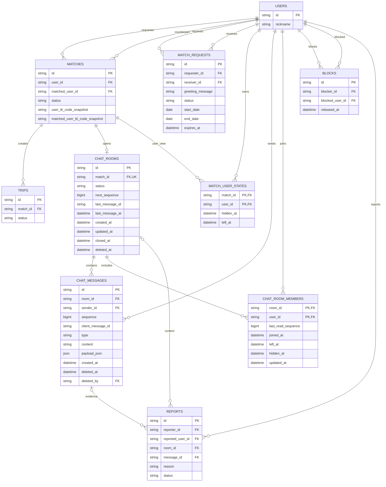

# OddTrip ERD

이 문서는 현재 백엔드의 SQLAlchemy 모델을 기준으로 작성한 ERD다. 실제 PostgreSQL 데이터베이스를 역분석한 결과가 아니므로, DB에 반영된 스키마와 차이가 있을 수 있다. 현재 저장소에는 Alembic revision 파일이 없으며 애플리케이션 시작 시 `Base.metadata.create_all()`로 신규 테이블을 생성한다.

## 현재 구현된 스키마

mermaid
erDiagram
    USERS {
        string id PK
        string email UK
        string password_hash
        string nickname
        string avatar_url
        string home_region
        string role
        string tti_code
        json tti_scores_json
        datetime created_at
        datetime updated_at
    }

    REFRESH_TOKENS {
        string id PK
        string user_id FK
        string token_hash UK
        datetime expires_at
        datetime revoked_at
        datetime created_at
    }

    MATCHES {
        string id PK
        string user_id FK
        string matched_user_id FK
        string match_level
        int recommendation_score
        string compatibility
        json differences_json
        json complements_json
        datetime created_at
    }

    TRIPS {
        string id PK
        string match_id FK
        string title
        string region
        date start_date
        date end_date
        json preferences_json
        string status
        datetime created_at
        datetime updated_at
    }

    PLACES {
        string id PK
        string content_id UK
        string content_type_id
        string source
        string name
        string category
        string image_url
        string description
        string addr1
        string addr2
        float latitude
        float longitude
        string area_code
        string sigungu_code
        string tel
        string homepage
        json opening_hours_json
        json closed_days_json
        boolean indoor
        boolean active
        json raw_json
        datetime created_at
        datetime updated_at
    }

    TRIP_ATTRACTIONS {
        string id PK
        string trip_id FK
        string place_id FK
        boolean saved
        boolean excluded
        boolean famous
        string reason
        json tags_json
        int score
        int congestion_score
        int hidden_score
        int related_rank
        datetime created_at
    }

    ITINERARY_DAYS {
        string id PK
        string trip_id FK
        int day_number
        date target_date
        string title
        string weather
        string caution
    }

    ITINERARY_ITEMS {
        string id PK
        string day_id FK
        string place_id FK
        int sort_order
        string time
        string type
        string title
        string location
        string duration
        string move_time
        string description
        string ai_reason
    }

    SAFETY_ALERTS {
        string id PK
        string trip_id FK
        string level
        string title
        string message
        string action
        string time
        datetime created_at
    }

    TTI_QUESTIONS {
        string id PK
        string axis
        string prompt
        string left_label
        string right_label
        string left_letter
        string right_letter
        int sort_order
    }

    TRAVEL_TYPES {
        string code PK
        string title
        string description
        json keywords_json
    }

    USERS ||--o{ REFRESH_TOKENS : owns
    USERS ||--o{ MATCHES : requester
    USERS ||--o{ MATCHES : counterpart
    MATCHES ||--o{ TRIPS : creates
    TRIPS ||--o{ TRIP_ATTRACTIONS : recommends
    PLACES ||--o{ TRIP_ATTRACTIONS : selected_for
    TRIPS ||--o{ ITINERARY_DAYS : contains
    ITINERARY_DAYS ||--o{ ITINERARY_ITEMS : contains
    PLACES o|--o{ ITINERARY_ITEMS : referenced_by
    TRIPS ||--o{ SAFETY_ALERTS : has
```

### 현재 주요 제약

- `matches`: `(least(user_id, matched_user_id), greatest(user_id, matched_user_id))` 고유 인덱스로 A-B와 B-A 중복 매칭을 차단한다.
- `trip_attractions`: `(trip_id, place_id)`가 고유하다.
- `itinerary_days`: `(trip_id, day_number)`가 고유하다.
- `places.content_id`, `users.email`, `refresh_tokens.token_hash`는 고유하다. nullable 컬럼은 여러 개의 `NULL`을 가질 수 있다.
- 사용자, 매칭, 여행, 일정의 주요 FK는 상위 행 삭제 시 `CASCADE`로 삭제된다.
- `itinerary_items.place_id`는 장소 삭제 시 `NULL`로 변경된다.
- `users.tti_code`는 `travel_types.code`를 논리적으로 참조하지만 DB 외래키는 설정되어 있지 않다.
- `matches`에는 `active`, `ended` 상태와 매칭 당시 양쪽 TTI 스냅샷이 추가됐다.

## 매칭 커뮤니케이션 모델 포함 스키마

아래 테이블은 SQLAlchemy 모델에 반영됐다. 기존 PostgreSQL DB 적용용 Alembic migration은 아직 만들지 않았다.



### 매칭·채팅 주요 제약

- `chat_rooms.match_id`는 고유하며 매칭 하나당 채팅방은 최대 하나다.
- `chat_messages`의 `(room_id, sequence)`는 고유해 방 안의 메시지 순서를 보장한다.
- `chat_messages`의 `(sender_id, client_message_id)`는 고유해 재시도에 따른 중복 저장을 막는다.
- `chat_room_members`와 `match_user_states`는 각각 `(room_id, user_id)`, `(match_id, user_id)` 복합키다.
- pending 매칭 요청과 활성 차단은 PostgreSQL partial unique index로 중복을 막는다.
- `last_message_id`는 순환 DDL 의존성을 피하기 위해 실제 FK를 두지 않고 서비스 트랜잭션에서 실제 메시지 ID로 갱신한다.
- 메시지 삭제는 `deleted_at`만 기록하며 신고 검토를 위해 원문을 유지한다.

## 실제 PostgreSQL과 비교하는 방법

PostgreSQL 연결과 migration이 정리된 뒤에는 DBeaver에서 `Schemas > public > Tables`를 선택하고 **View Diagram**을 실행한다. 그 결과를 이 문서와 비교하면 모델과 실제 DB 사이의 누락된 컬럼, FK, 인덱스를 확인할 수 있다.
